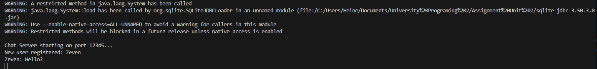
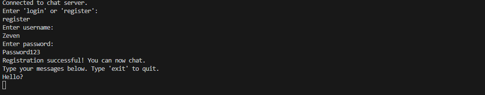

# Java Multi-User Chat Application

A simple online chat app built in Java using socket programming for real-time messaging between multiple clients. Features include user authentication (login/register), SQLite database for user accounts and chat logs, and multithreading for handling connections.

## Features
- **Server-Client Architecture**: Server handles multiple client connections and broadcasts messages.
- **User Authentication**: Register or login with username/password (passwords hashed with SHA-256).
- **Persistent Storage**: SQLite DB stores user details and chat history (timestamps, senders, messages).
- **Graceful Handling**: Clients can disconnect with 'exit'; server logs events.

## Technologies
- Java (Sockets, Multithreading, JDBC)
- SQLite (via sqlite-jdbc driver)

## Setup and Running
### Prerequisites
- Java JDK 8+
- Download sqlite-jdbc-3.50.3.0.jar (included in repo or from [Maven](https://mvnrepository.com/artifact/org.xerial/sqlite-jdbc))

### Steps
1. Clone the repo: `git clone https://github.com/Zeven243/Java-Chat-App.git`
2. Navigate to the folder: `cd Java-Chat-App`
3. Compile: `javac -cp ".;sqlite-jdbc-3.50.3.0.jar" ChatServer.java ChatClient.java` (use `:` on Unix/Mac)
4. Run Server: `java -cp ".;sqlite-jdbc-3.50.3.0.jar" ChatServer`
5. Run Clients (in separate terminals): `java -cp ".;sqlite-jdbc-3.50.3.0.jar" ChatClient`
   - Follow prompts for register/login.
   - Chat by typing messages; exit with 'exit'.

### Database Viewing
- Use DB Browser for SQLite (free download: https://sqlitebrowser.org/) to open `chat.db`.
- Tables: `users` (usernames, password hashes), `chat_logs` (timestamps, senders, messages).

## Screenshots

## Challenges and Learnings
- Handled concurrency with threads to avoid blocking.
- Implemented secure auth with hashing.
- Integrated JDBC for persistence.

This was built as a university assignment but enhanced for portfolio purposes. Feel free to fork and improve!

License: MIT